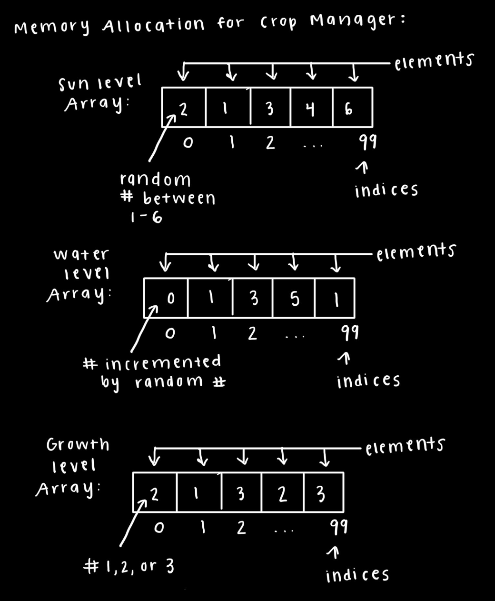

# Devlog Entry F0 - 20 November 2023
## Introducing the Team
Tools Lead: Joshua Widjaja

Engine Lead: Chase Houske

Design Lead: Nicholas Puckdee

Pallavi Rajeev

Reese Garcia

## Tools and Materials
1.) For this final project, our team chose the Unity Game Engine because of its user-friendly design and the convenience of using the C# programming language. Unity's accessibility for developers of all levels is complemented by the powerful scripting language C#, which enhances the overall ease and efficiency of the development process. This combination allows us to efficiently bring our creative ideas to life and ensures a smooth development process.

2.) Our team chose C# for this project because the Unity Game Engine is built to work with the C# language. Using C# for our project with Unity makes things easier and ensures that the programming language and game engine work well together.

3.) We will use Visual Studio Code as our IDE for this project. We chose to use VS Code because all team members are familiar with this platform. We have also all pretty much used it in our other classes. Additionally, Visual Studio Code has useful features like intellisense, that can make our coding process and game development more efficient. 

## Outlook
This will be the first time using Unity and C# for some group members. Although we'll still use the engine for its above benefits, we'll still need to dedicate some extra time to teach them and get them acclimated to the environment. By the end of this project, we are hoping to earn further practice and familiarize ourselves with
the toolset provided within Unity. This will allow us to develop a set of skills in which can be applied to
future Unity based projects in the future.

## How we satisfied the software requirements
[F0.a] You control a character moving on a 2D grid.
Our game’s implementation allows you to control a character moving on a 2D grid using the keyboard inputs. The code detects which key is being pressed down by firing a keydown event and storing that input. Therefore, when the player presses down on the arrow keys, they are able to move correspondingly. The up arrow moves the character up, down arrow moves the character down, right arrow moves the character to the right, and left arrow moves the character to the left. 

[F0.b] You advance time in the turn-based simulation manually.
Each time the player moves around on the game space, they can do one of two actions: planting or harvesting crops, using the ‘z’ and ‘x’ keys respectively. When a player does one of these actions, an event will be triggered, advancing the player to their next turn. After this, the game will update the sun and water levels of the board, allowing for play to continue.

[F0.c] You can reap (gather) or sow (plant) plants on the grid when your character is near them.
When the player’s coordinates are close to a plant, they are able to reap or sow the plants. In order to reap or sow the plant, the player can use ‘x’ to reap or ‘z’ to sow. Once again our code triggers a keydown event when the player presses down on either of these keys. When either of these keys are pressed and the player decides to reap or sow the plant they are by, the plant is destroyed (if the player chooses to harvest it) or a new material is created using an array of coordinates to select a type of plant (if the player chooses to plant a plant). 

[F0.d] Grid cells have sun and water levels. The incoming sun and water for each cell is somehow randomly generated each turn. Sun energy cannot be stored in a cell (it is used immediately or lost) while water moisture can be slowly accumulated over several turns.
When the player triggers an event to advance their turn, the game will reset the sun level and spawn sun and water for the next turn. This is accomplished by calling a series of functions to reset a turn. At the end of a turn, the first function will reset the sun level to 0. Then two more functions are called to randomly generate numbers, determining the sun level and water level for the next turn.

[F0.e] 
Each plant on the grid has a type (e.g. one of 3 species) and a growth level (e.g. “level 1”, “level 2”, “level 3”).
Each crop cell has a growth level being an int 0-2 representing level 1-3. Each crop cell also has a species, a string, which is tomato, corn, or melon. The cube is accordingly red, yellow, or green based on the species.

[F0.f] 
Simple spatial rules govern plant growth based on sun, water, and nearby plants (growth is unlocked by satisfying conditions).
If the sun and water level exceeds a certain value, the crop's growth level will increase. It can increase multiple levels each turn if the water has scaled to a high value with previous turns having bad sun rolls, making the crop unable to grow even with high water values. The crop growing increases the crop's x, y, and z scales.

[F0.g] 
A play scenario is completed when some condition is satisfied (e.g. at least X plants at growth level Y or above).
Based on the crop level being harvested, that crop level number is added to a total points. Since crops you plant start at level 0, if you harvest an "unleveled" one you get 0 points. If the points exceeds 10, you get a message in the console saying "You Win!".

## Reflection
Looking back on how you achieved the F0 requirements, how has your team’s plan changed? Did you reconsider any of the choices you previously described for Tools and Materials or your Roles? It would be very suspicious if you didn’t need to change anything. There’s learning value in you documenting how your team’s thinking has changed over time.

Initially we were thinking of having copies of the crops in the scene view. However, since an announcement was made not wanting us to use the scene view at all, we realized we had to make some changes in our plan. So instead of using the scene view, we decided to make the crops colored cubes for now. This allows us to easily create the crops in code without having to apply some mesh to them. The setup of having a crop manager and a crop cell class and their roles have also changed over time. Originally there was no crop cell class.

# Devlog Entry F1 - 05 December 2023
## How we satisfied the software requirements
[F0.a] Same as last week

[F0.b] Same as last week

[F0.c] The implementation for reap and sow mostly remains the same, in which a plant is placed based on the players coordinates and a plant is destroyed upon being harvested. In this version, plants are now being created and stored into an array by indexing into an array and setting its value respectively. When harvesting, this version will now destroy the object at a specific index of an array, while also resetting the sun, water, and growth levels.

[F0.d] This implementation is the same as last week, with a minor change now being the new values for sun and water levels are stored in an array based on the location of a cell.

[F0.e] Same as last week

[F0.f] This implementation is the same as last week, with a minor change now being the growth levels are stored and modified through an array.

[F0.g] Same as last week

[F1.a] The important state of each cell of your game’s grid must be backed by a single contiguous byte array in AoS or SoA format. Your team must statically allocate memory usage for the whole grid.
In our implementation, this version of the game utilizes the SoA format to allocate memory usage into a byte array. Inside a structure to represent the grid space, known as CropManager, there are three byte arrays, whose indices connect to each individual cell of the game space. These byte arrays represent the sun levels, water levels, and growth levels.



[F1.b] The player must be able to undo every major choice (all the way back to the start of play), even from a saved game. They should be able to redo (undo of undo operations) multiple times.
Our game’s implementation allows you to undo and redo using the keyboard inputs. The code detects which key is being pressed down by firing a keydown event and storing that input. Therefore, when the player presses down on the q key, they are able to undo their previous actions and when the player presses down on the w key they are able to redo what they last undid. When undoing and redoing, the saved board states (including the crop objects, sun levels, water levels, growth levels, and the crop species) are being pushed off of one stack and popped onto the corresponding stack.

[F1.c] The player must be able to manually save their progress in the game in a way that allows them to load that save and continue play another day. The player must be able to manage multiple save files (allowing save scumming).
When the player wants to save their progress, they can press down on the corresponding key, to fire a keydown event. This keydown event allows the player to save the current board states and allow them to keep that progress and continue playing with those same board states at a different time. 

[F1.d] The game must implement an implicit auto-save system to support recovery from unexpected quits. (For example, when the game is launched, if an auto-save entry is present, the game might ask the player "do you want to continue where you left off?" The auto-save entry might or might not be visible among the list of manual save entries available for the player to load as part of F1.c.)
Each time the player commits an action in the game, an event is triggered to generate the next turn. When this event occurs, values for the gameplay are reset, while the state of the game is saved as well. The data included is the same as what is saved for each undo and redo action. This allows the player to continue from their most recent save state of the game.

## Reflection
Looking back on how you achieved the new F1 requirements, how has your team’s plan changed? Did you reconsider any of the choices you previously described for Tools and Materials or your Roles? Has your game design evolved now that you've started to think about giving the player more feedback? It would be very suspicious if you didn’t need to change anything. There’s learning value in you documenting how your team’s thinking has changed over time.

Initially when coding our game, we did not store the data for each cell into an array. Most time spent for satisfying F1 related back to refactoring cell data to be stored into individual arrays, all held within a structure. Prior to reworking the data structure into this format, the game originally created a new object to be added onto the board. When refactoring in this updated version, we now have arrays to hold objects in the game, along with separate arrays to store data values for other aspects of each cell. The indices of cropObjects, the array used to store cell data, store individual objects, whenever a new object is added to the board.

Even though we didn't finish the save/load, we had to think differently and come up with a new trick to save. C# without libraries installed doesn't have json.parse and json.stringify as a default, which was the old plan to accomplish saving and loading using files. We would have to write our own data parser for saving and loading our array's data but we didn't have the time.

# Devlog Entry F2 - 10 December 2023
## How we satisfied the software requirements
### F0+F1
The devlog should briefly comment on how the previous F0 and F1 requirements remain satisfied in the latest version of your software. If no major changes were made, you can just simply state that no major changes were made. However, if you evolved your design to improve code quality (a good idea!), this section of your devlog entry would be a good place to brag about it.

[F0.a-g] Same as last week
[F1.a-d] Same as last week

### External DSL for Scenario Design
The devlog should explain the design of your external DSL for scenario design. Tell us which pre-existing data language (e.g. JSON/YAML/TOML)  your DSL is based on. If it is not based on a pre-existing language, briefly explain your choice. Show us a short example of a scenario definition in this new language (even if it doesn't exactly match one used in your game's actual code). Next to the code example, give us a natural language translation of the meaning of that program so we can begin to learn how your language works.

Use Markdown to create a code block when sharing an example of your language.

For our external DSL, our team chose not to base our DSL on a pre-existing data language. We chose this as a route for simplicity and ease of integration with pre-existing code. In addition, by using a custom format to this solution, it enables our team to have more control over implementing features in the future. Instead of a previous format, our team uses a TXT file to parse through lines of text, which is then utilized in our game. Our design works as each line in the corresponding TXT file relates to a cell on the game board, specifying its coordinates, sun level, water level, growth level, and crop species. The file also contains some sort of setup for the initial board state, essential for if the user is planning to do crop cell data modification. 

```plain text
crop: corn sun: 10 water: 10 color: yellow
crop: tomato sun: 1 water: 1 color: red
```
In this example these lines indicate the addition of two species, and the base game has none by default you must have at least one in the file. The sun and water modifiers are multiplied by the requires values of sun and water for each growth level of each plant. So If you have sun: 10 and water: 10 you will need ten times as much sun and water just to go from the first to second growth level.

### Internal DSL for Plants and Growth Conditions
Using one or more short code examples (possibly with irrelevant or repetitive blocks removed with "/* ... */" comments), show us what it is like to use your DSL. Comment on which host language is being used (because the person reading your devlog might not have read the rest of your project's code to guess which language you are using). After the code example, explain the meaning of your code snippets in natural language to help us understand the meaning.
Make sure to highlight how your internal DSL allows using host language features that would be difficult to offer in an external DSL.
```c#
myMaterial.color = colorMap[cropSpecies[index].color];
if ((sunLevels[index] >= (3 * sunSizeMod)) && (waterLevels[index] >= (3 * waterSizeMod)) && (growthLevels[index] < 2))
```
Each time a line in our input file is set up correctly, an instance of a class called CropType(in c#) is created, that has a name, sunmod, watermod, and color, those being two doubles and two strings. The only method is the override of equals, which would be difficult to offer in an external dsl. This equality is used so exact same lines in our input file won't be added as a seperate crop type if there was accidentally a duplicate line. This allows our cropTypes array to use the IndexOf to find if the newly created croptype already exists in the array, and if so, don't add it.
## Reflection
Looking back on how you achieved the new F2 requirements, how has your team’s plan changed? Did you reconsider any of the choices you previously described for Tools and Materials or your Roles? Has your game design evolved now that you've started to think about giving the player more feedback? It would be very suspicious if you didn’t need to change anything. There’s learning value in you documenting how your team’s thinking has changed over time.

Although there haven't been many changes to our team’s plan, our game design has altered from our initial plan. Previously we had hoped to include bigger changes to our code for each step. However, because of finals and being short on time, we have started to scale down our ideas and focus on meeting the requirements. Additionally, we talked about using a pre-existing language model to complete our external DSL but found that going our own way would be easier for us to integrate into our code. Moreover, this helped us simplify our design to continue further implementations on the project.

# Devlog Entry F3 - 14 December 2023
## How we satisfied the software requirements
### F0+F1+F2
The devlog should briefly comment on how the previous requirements remain satisfied in the latest version of your software. If no major changes were made, you can just simply state that no major changes were made. However, if you evolved your design to improve code quality (a good idea!) this section of your devlog entry would be a good place to brag about it.

[F0.a-g] Same as last week
[F1.a-d] Same as last week
[F2.a-b] Same as last week

### Internationalization
The devlog should explain how your code has changed to distinguish between strings internal to the program and strings that will be shown to the player (needing localization). If you did something clever with your language's type system so that the compiler helps you catch incomplete translations or other missing messages, brag about that in this section.

This section should outline which code or data files need to get changed when adding support for a new language or adding a new translatable message to the game.

In our code, we have a separate file, LanguageManager.cs, which contains information for our selected languages. In this file, the code will detect commands given by the user, by selecting a button of their choice, with the language associated to that button being set as the default language button for the current playthrough of the game.

### Localization
Tell us about which three languages your game supports. For each language, tell us about how you accomplished that localization. Did a team member use their own knowledge of the language? Did you have a friend, volunteer classmate, or paid expert help? Did you make use of a tool like ChatGPT to help? (If so, describe your prompts so that we can see how you gave the system extra context for your project.)

How should the user select which language will be used? Do they change the language setting from inside the game? Did you release three different versions of the game with a different language hard-coded into each? Does the player launch the game with special options (e.g. command line arguments or URL parameters) that encode the choice of language?

Upon starting up the game, there are buttons the player can press to switch between three languages supported in the game: English, Japanese, and Hebrew. When a button is pressed, the game will then be altered to utilize that chosen language. These languages were chosen each for different reasons. Since everyone on the team speaks English, this was our default language everyone where everyone is an expert. For Japanese, one of our team members were already familiar with this language, opting for this as our second option. Finally, Hebrew was chosen as it was a more simple language for our team to work with, as compared to languages such as Arabic.

### Mobile Installation

How did you get your game to be installable on a smartphone-class mobile device? If you followed a tutorial, guide, video, or blogpost, directly link to those resources that helped you learn. What changes were needed to make the game installable?
We built the game to IOS using unity, but had problems due to you needing a mac computer to build an IOS app. There is an app that allows you to play your unity games on mobile when the phone is plugged in using a cord to your computer, but that isn't really an "installable" game.

### Mobile Play (Offline)

What changes to your design were needed to make it play well on a mobile device? Were there any changes needed to make sure it worked in the offline case?

When implementing mobile play, our team mostly focused on changing how a player interacts with the game. Up to this point, we have been detecting player inputs by having the code listen for any keys being pressed down. Once a key was pressed, a given event would be triggered, and the game would be updated in some form. For implementing mobile play, we added in the ability to detect player inputs by tapping on screen buttons, which act the same way as the key events, but allow the use of a touch screen instead.

## Reflection
Looking back on how you achieved the new F3 requirements, how has your team’s plan changed? Did you reconsider any of the choices you previously described for Tools and Materials or your Roles? Has your game design evolved now that you've started to think about giving the player more feedback? It would be very suspicious if you didn’t need to change anything. There’s learning value in you documenting how your team’s thinking has changed over time.
Our plan really hasn't changed. The only thing that has been thought about differently is creation of UI that would look good on mobile if you made a game that you might port to mobile and PC in the future, without doing some complicated platform-specific repositioning of UI elements.

